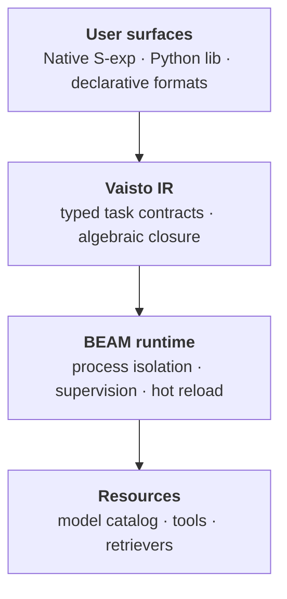

# Vaisto

**Finnish for "intuition"** — a typed substrate for LLM operations.

## The problem

LangChain pipelines written in 2023 don't run in 2026. Not because the code rotted — because the abstractions did. The model API changed, the recommended retrieval pattern changed, the wrapper library rewrote its surface twice. The pipeline you wrote is a fossil of when its dependencies were stable, which was never.

Every domain that built durable software found a layer that survives churn beneath it. Operating systems found POSIX. Networks found sockets. Databases found relational algebra. LLM systems don't have one yet — so they break.

## The missing layer

What 2023 pipelines lacked was a **task contract** separable from its implementation: a description of the work the pipeline performs that does not name the model performing it.

A task contract specifies what good enough looks like — typed inputs, typed outputs, declared budgets, declared failure semantics. Any model that meets the contract is a legal binding. As models improve, more models become legal bindings. The contract never has to change, because the contract was never about a model.

## Where Vaisto fits

Vaisto is the typed substrate that makes those contracts compile and compose. You don't write Vaisto code as a programming language — you write task contracts (in whatever surface fits your team) and they compile to Vaisto's algebraic IR, which the type checker and runtime then make real.



This means:
- **Closure is enforced by the compiler**, not by convention. A pipeline that doesn't compose refuses to compile.
- **Failures are typed and supervised** at the BEAM runtime level. Rate-limits, timeouts, malformed extracts surface as typed events, not stack traces.
- **Implementations can change** — model, prompt, tool — without rewriting the contracts that depend on them.

## What the compiler catches

A prompt declares its response schema, and a pipeline binds against it:

```scheme
(deftype Question [text :String])
(deftype CitedAnswer [text :String evidence (List DocId)])
(deftype Answer [text :String evidence (List DocId)])

(defprompt answer-with-citations
  :input  Question
  :output CitedAnswer
  :template """
  Answer with citations.
  Question: {text}
  """)

(pipeline legal-qa
  :input  Question
  :output Answer
  (generate :prompt answer-with-citations :extract Answer))
```

Someone "improves" the prompt to drop citations:

```scheme
(deftype CitedAnswer [text :String])    ; ← evidence field removed
```

The compiler refuses to compile, before the change reaches production:

```
error: prompt output type mismatch
  at line 6
      (generate :prompt answer-with-citations :extract Answer)
      ^ expected `Answer`, found `CitedAnswer`
  note: prompt `answer-with-citations` output CitedAnswer
        does not satisfy extract target Answer
  note: missing field: evidence : (List DocId)
```

A class of failure that today reaches production silently becomes a compile error.

→ For the full thesis, see [docs/design/task-contracts-manifesto.md](docs/design/task-contracts-manifesto.md).

## Status

Early. Working core:
- ✅ Parser (s-expressions → AST, multi-line heredocs)
- ✅ Type checker (Hindley-Milner inference, prompt-output unification)
- ✅ Elixir backend (compiles pipelines to runnable functions)
- ✅ Core Erlang backend (alternative compilation target)
- ✅ LSP server (hover, diagnostics, symbols)
- ✅ VS Code extension
- ✅ Mock LLM provider for tests
- ✅ OpenAI provider via `:httpc` with structured outputs

Roadmap:
- 🚧 Cost-based optimizer for `:model auto` binding
- 🚧 Model catalog (cost/quality profiles)
- 🚧 Additional operators (`verify`, `retrieve`, `tool`, `parallel`)
- 🚧 Non-native user surfaces (Python library, declarative formats)

## Quickstart

```bash
git clone https://github.com/yairfalse/vaisto.git
cd vaisto
mix deps.get
mix test
```

Build the CLI:

```bash
mix escript.build
./vaistoc --eval "(+ 1 2)"
./vaistoc build src/ -o build/
./vaistoc repl
```

Run a pipeline against the OpenAI provider:

```elixir
# In iex -S mix
iex> Application.put_env(:vaisto, :llm, Vaisto.LLM.OpenAI)
iex> System.put_env("OPENAI_API_KEY", "sk-...")
# (then compile and call your pipeline as usual)
```

## Editor support (VS Code)

Vaisto has an LSP server and VS Code extension for real-time type feedback.

```bash
mix escript.build
cd editors/vscode
npm install
```

Open `editors/vscode` in VS Code and press **F5** to launch the Extension Development Host. Open any `.va` file to get hover types, diagnostics, and symbol navigation.

If `vaistoc` isn't in your PATH, add to VS Code settings:

```json
{
  "vaisto.serverPath": "/path/to/vaisto/vaistoc"
}
```

## Stack

| Layer | Tool | Purpose |
|-------|------|---------|
| Substrate | **Vaisto** | Typed IR for task contracts |
| Runtime | **BEAM** | Process isolation, supervision, distribution |
| Observability | **AHTI** | Causality correlation across operations |
| Deployment | **SYKLI** | CI for systems built on contracts |

## Related work

- **DSPy** — Python, optimizer for prompt-tuning. No structural closure, no runtime supervision.
- **LangChain / LlamaIndex** — composition by convention. The thing this is in tension with.
- **Gleam** — typed BEAM, ML-style syntax. Real production language; closer architectural cousin (we share BEAM, differ on syntax and type-system shape).
- **LFE** — Lisp on BEAM, untyped. Same syntax family, no type system.

## Origin

Conceived January 2026, 3am Berlin, while waiting for family to fly home. Started as "learn Elixir methodically," became a language design through following intuition.

## License

MIT
